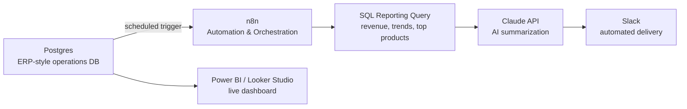

# automated-sales-reporting-pipeline
Connecting a core operations database to AI-powered reporting. cutting a manual, multi-hour reporting request down to a scheduled, zero-touch automation
--

## The Problem

Departments across a business regularly need up-to-date sales and operations data — revenue by region, product performance, week-over-week trends. Without automation, every one of those requests becomes manual work: someone queries the database by hand, builds a report, and emails it out. This creates a bottleneck for IT and delays decision-making for everyone else.

This project automates that entire chain — from raw operational data to a plain-language summary delivered automatically — using the same integration pattern applicable to any ERP, SQL database, or BI stack.

## Architecture

**Flow:** `Manual Reporting Request → System Integration → Automated Workflow → Faster Data Access → Reduced IT Bottleneck`

## What's in this repo

| Path | What it does |
|---|---|
| `sql/schema.sql` | Core ERP-style operations schema: `customers`, `products`, `orders`, `order_items` |
| `sql/seed_data.sql` | ~200 orders / ~550 line items across 10 weeks of synthetic sales activity |
| `sql/reporting_query.sql` | The reporting logic: weekly revenue by region with week-over-week % change (window functions), top 5 products, and a summary query that feeds the AI step |
| `workflow/n8n_workflow.json` | Importable n8n workflow — schedule trigger → Postgres query → Claude API summarization → Slack delivery |
| `docs/setup.md` | Step-by-step guide to stand this up yourself in ~30–45 minutes |

## What this demonstrates

- **Systems integration** — connecting a SQL database to an automation platform and a messaging tool as three distinct systems wired together
- **SQL proficiency** — joins, aggregation, and window functions (`LAG()` for week-over-week comparison) against realistic relational data
- **Practical AI application** — using an LLM to turn structured query output into a plain-language business summary, not building a model from scratch
- **Automation workflow design** — a scheduled, unattended pipeline replacing a manual, on-request process
- **BI/reporting integration** — the same database powers a live dashboard alongside the automated summary

## Tech stack

`PostgreSQL` · `n8n` · `Claude API` · `Power BI / Looker Studio` · `Slack`

## Why this pattern, not a specific ERP

This project uses PostgreSQL rather than a named commercial ERP because the integration pattern is identical regardless of vendor — SAP, NetSuite, Odoo, and Dynamics all expose data through the same shape (a relational database behind a reporting layer). The skill being demonstrated is connecting *any* structured operational data source to automation and AI, which is the transferable part.

here's the link to the dashboard: https://datastudio.google.com/reporting/2b9d1cdd-1739-4f4d-b187-b163c07f4641
